<br />
<div align="center">
  <a href="https://github.com/noahzmr/react-chat">
    
  </a>

  <h3 align="center">React Chat App</h3>

  <p align="center">
    A little inspiration for people who want to start a chat app with React!
    <br />
    <a href="https://github.com/noahzmr/react-chat"><strong>Explore the docs »</strong></a>
    <br />
    <br />
    <a href="https://chat.noerkelit.online/">View Live Demo</a>
    ·
    <a href="https://github.com/noahzmr/react-chat/issues">Report Bug</a>
    ·
    <a href="https://github.com/noahzmr/react-chat/discussions">Request Feature</a>
  </p>
</div>

<details>
  <summary>Table of Contents</summary>
  <ol>
    <li>
      <a href="#introduction">Introduction</a>
      <ul>
        <li><a href="#built-with">Built With</a></li>
        <li><a href="#coming-soon">Coming Soon </a></li>
      </ul>
    </li>
    <li><a href="#functions">Functions</a>
      <ul>
        <li><a href="#login">Login</a>
          <ul>
            <li><a href="#custom-login">Custom Login</a>
              <ul>
                <li><a href="#sign-up">Sign Up</a>
                  <ul>
                    <li><a href="#custom-login#jest-test">Jest Test</a>
                      <ul>
                        <li><a href="#custom-login#jest-test#without-errors">Without errors</a></li>
                        <li><a href="#custom-login#jest-test#with-errors">With errors</a></li>
                      </ul>
                    </li>
                  </ul>
                </li>
                <li><a href="#first-login">First Login</a>
                  <ul>
                    <li><a href="#without-otp">Without OTP</a></li>
                    <li><a href="#with-otp">With OTP</a></li>
                  </ul>
                </li>
              </ul>
            </li>
            <li><a href="#keycloak">Keycloak</a>
              <ul>
                <li><a href="#what-is-keycloak?">What is keycloak?</a></li>
                <li><a href="#keycloak#sign-up">Sign Up</a>
                  <ul>
                    <li><a href="#keycloak#jest-test">Jest Test</a>
                  </ul>
                </li>
              </ul>
            </li>
          </ul>
        </li>
        <li><a href="#profile">Profile</a></li>
        <li><a href="#messanges">Messanges</a></li>
        <li><a href="#video">Video</a></li>
        <li><a href="#notifications">Notifications</a></li>
        <li><a href="#mobile-version">Mobile Version</a></li>
        <li><a href="#monitoring">Monitoring</a>
          <ul>
            <li><a href="#prometheus">Prometheus</a></li>
            <li><a href="#grafana">Grafana</a></li>
            <li><a href="#sonarqube">SonarQube</a></li>
            <li><a href="#sentry">Sentry</a></li>
          </ul>
        </li>
        <li><a href="#testing">Testing</a></li>
        <li><a href="#patches">Patches</a></li>
      </ul>
    </li>
    <li><a href="#architecture">Architecture</a>
      <ul>
        <li><a href="#sql">SQL</a></li>
        <li><a href="#network">Network</a></li>
      </ul>
    </li>
    <li><a href="#setup">Setup</a>
    <li><a href="#contact">Contact</a></li>
    <li><a href="#hosted">Hosted</a></li>
    <li><a href="#support">Support</a></li>
    <li><a href="#demo">Demo</a></li>
  </ol>
</details>

## Introduction

This is a simple chat app built with the help of Socket.IO, React and ExpressJS and use a MariaDB as the database.
It is not a secure messanger.
The project is more a kind of inspiration and help for people who want to build their own messanger.
Currently it is still the first version and has minor bugs, with future versions these will be fixed and new features will be added.

### Built With

[](https://expressjs.com/de/)
[](https://reactjs.org)
[](https://icons.getbootstrap.com/)
[](https://socket.io/)
[](https://mariadb.com/docs/)
[](https://www.npmjs.com/)
[](https://www.javascript.com/)
[](https://www.docker.com/)
[](https://ubuntu.com/download?gclid=Cj0KCQiA37KbBhDgARIsAIzce16YF-tHi0cfujV9iwI4m9iC1zlTmt7il2I-97BzOt8PvtOG8AlIApEaAuCaEALw_wcB)
[](https://docs.renovatebot.com/)
[](https://purgecss.com/)
[](https://www.javascript.com/)
[](https://about.gitlab.com/resources/scaled-ci-cd/?utm_medium=cpc&utm_source=google&utm_campaign=singleappci_emea_pr_rsa_nb_exact_&utm_content=scaled-ci-cd_digital_x-pr_english_&&utm_term=ci%20cd&_bt=626050032843&_bk=ci%20cd&_bm=b&_bn=g&_bg=103866327354&gclid=Cj0KCQiAkMGcBhCSARIsAIW6d0D1Y3nJO2wh0tH5-NYqUGQ0qftov1pSSJQwPA3Z7piJ8Yc8Ex1IKLkaAiMiEALw_wcB)

[](https://min.io/)
[](https://github.com/ealush/emoji-picker-react)
[](https://github.com/speakeasyjs/speakeasy)
[](https://nodemailer.com/about/)
[](https://prometheus.io/)
[](https://grafana.com/)
[](https://nodejs.org/en/)
[](https://eslint.org/)
[](https://reactrouter.com/en/main)
[](https://developer.mozilla.org/en-US/docs/Web/API/WebRTC_API)
[](https://peerjs.com/)
[](https://www.sonarqube.org/)
[](https://www.keycloak.org/)
[](https://de.gravatar.com/)
[](https://sentry.io/)
[](https://www.selenium.dev/)
[](https://jestjs.io/)
[](https://github.com/remarkjs/react-markdown)

### Coming Soon

[](https://www.vaultproject.io/)
[](https://www.terraform.io/)

## Functions

### <strong>Login</strong>

- [x] Custom SignIn/SignUp
  - [x] With OTP
- [x] Log in with a specific user.
- [x] Diffrent Providers with Keycloak
  - [x] 
  - [x] 
- [x] Email verification, by Custom Login

#### <strong>Custom Login</strong>

##### <strong>Sign Up</strong>

The sign up form created by the user is relatively simple.
First, the user must set the following parameters:

- Name
- E-mail
- Password
- Repeat password

If the parameters have been set and the passwords match, the terms and conditions must be agreed to.
Now the data is used in the backend, a unique ID is generated, from which an e-mail is generated. As long as the user has not gone to the link from the e-mail, he may not log in.


###### <strong>Jest Test</strong>

###### <strong>Without errors</strong>

If everything was successful, it should look like this:

[](https://user-images.githubusercontent.com/65290559/231198247-062e713b-980a-435f-8d94-bbf0dd202f9e.mp4)

###### <strong>With errors</strong>

On the other hand, it would go like this:

[](https://user-images.githubusercontent.com/65290559/231503927-420df5b3-db1d-43f0-a020-ead36c374a02.mp4)

##### <strong>First Login</strong>

After the registration was successful you can log in, but the first login has a special feature - you can activate a two-factor authentication. This option is currently not available with Keycloak.
The login procedure is relatively simple straigth forward:


###### <strong>Without OTP</strong>

https://user-images.githubusercontent.com/65290559/232424492-0d51007b-f9a5-4e6b-9349-90fce8ae6648.mp4

###### <strong>With OTP</strong>

https://user-images.githubusercontent.com/65290559/232449425-a71ed0d7-3109-484c-b2f9-de80c7d9de08.mp4

#### <strong>Keycloak</strong>

##### <strong>What is keycloak?</strong>

First of all, what is keycloak?

Keycloak is an open-source identity and access management solution that provides Single Sign-On (SSO) capabilities for web applications and services. It uses open protocols like OpenID Connect, OAuth 2.0, and SAML 2.0 to authenticate and authorize users.

Here's a high-level overview of how Keycloak works:

1. User logs in to an application: When a user tries to log in to an application, they are redirected to the Keycloak authentication server.
2. User authentication: The Keycloak server verifies the user's identity by checking their username and password against the configured authentication provider. This can be a local database, LDAP server, or social login provider like Google or Facebook.
3. Token issuance: Once the user is authenticated, Keycloak issues a token that contains the user's identity and other relevant information like their roles and permissions.
4. Token validation: The application can then use the token to verify the user's identity and authorize them to access protected resources. The token is signed and encrypted to prevent tampering.
5. Logout: When the user logs out of the application, Keycloak revokes the token and logs the user out of all the applications that use Keycloak for authentication.

Keycloak can also act as a central authentication and authorization service for multiple applications, allowing users to access all their resources with a single set of credentials. It provides a user-friendly interface for managing users, roles, and permissions, and can be integrated with popular development frameworks like Spring and Angular.

Simpler said you know how when you go to some websites or apps, you have to type in a username and password to get in? Keycloak is like a helper that makes that process easier and safer.

Instead of having to remember lots of different usernames and passwords for different websites and apps, Keycloak lets you use just one username and password for lots of different places. It's like having a magic key that unlocks lots of doors!

And Keycloak also helps keep your username and password safe. It makes sure that nobody else can steal them or use them without your permission. That way, you can use the internet and your apps without worrying about bad people getting your information.

So Keycloak is like a helpful friend that keeps your information safe and makes things easier for you.

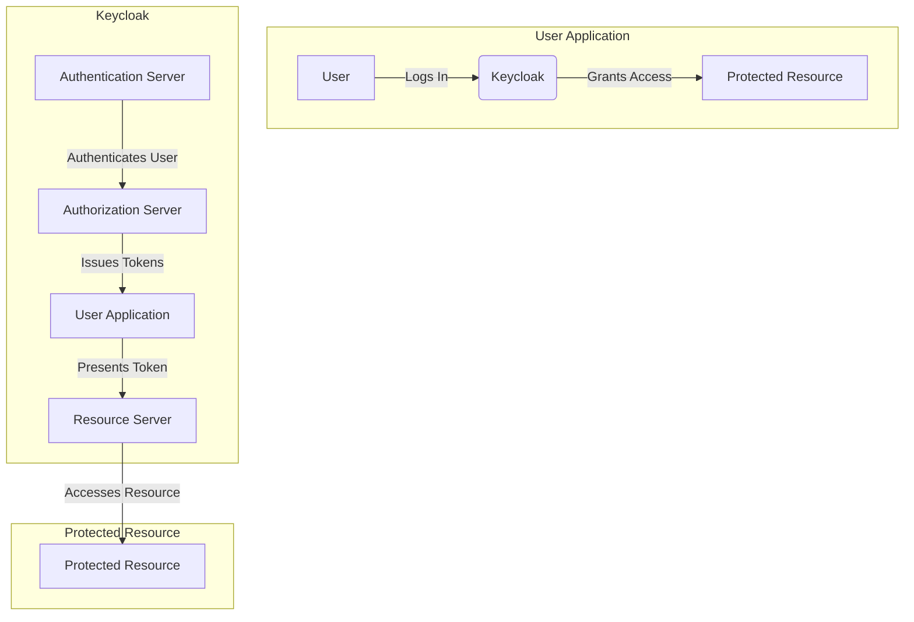

Keycloak has a feature called Social provider, this allows users to authenticate with their social media accounts, such as Facebook, Google, or Twitter, instead of creating a new username and password for each application they use. This provides a convenient and streamlined way for users to access multiple applications while maintaining their existing social media account information.

To use a social provider with Keycloak, you first need to configure the provider in the Keycloak Administration Console. This involves creating a new identity provider, providing the necessary configuration details, and optionally specifying the required scopes, roles, and mappers.

Once the social provider is configured, users can log in to the application using their social media account credentials. To do this, they select the social provider button on the application's login page, which redirects them to the corresponding social media login page. After the user successfully logs in to their social media account, the social media provider generates an access token and sends it back to Keycloak. Keycloak then verifies the access token, creates a new Keycloak user, and issues an access token and refresh token for the user.

After the user has successfully authenticated with the social provider, they can use the application just like any other user. The application can also use the Keycloak APIs to access the user's social media account information, such as their profile picture, email address, or friends list.

Overall, social provider is a convenient and secure way for users to authenticate with multiple applications using their existing social media accounts, while also allowing applications to access their social media information through Keycloak APIs.

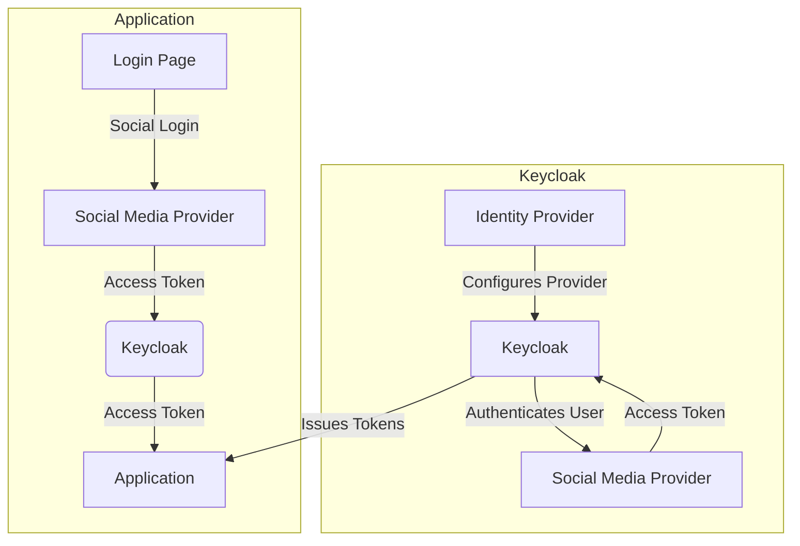


##### <strong>Sign Up</strong>

Alternatively it is also possible to register with Keycloak, here also a verification email is sent, unfortunately it is not possible with Selneium to log in to Google, because:

```
To better protect your account, starting May 30, 2022, Google will no longer support third-party apps or devices where your username and password are sufficient to sign in to your Google Account.
```

More information can be found [here](https://myaccount.google.com/lesssecureapps?pli=1&rapt=AEjHL4Nm2kwgZsiD11zZDzUTqbAYYUcn8OE7FZb1hIib0SGkOmy-xwQsUFtww7W6mRIBTEHGYl_vGCaZMf7qIrEZFbfFGOKZrQ)

###### <strong>Jest Test</strong>

Sign Up:

[](https://user-images.githubusercontent.com/65290559/231406405-fe9ecf8d-d5a4-4453-99e5-b2a643e665dc.mp4)

Sign In:

https://user-images.githubusercontent.com/65290559/232460582-a1dd734e-9ac1-42df-a19b-5df080226534.mp4

### <strong>Profile</strong>

Now that we have finished registering, we can customize our profile if desired.

https://user-images.githubusercontent.com/65290559/232544630-48e206b7-2772-4cb8-9c69-233eba59da8a.mp4

- [x] Information about the user.
  - [x] Socket Id.
  - [x] Join chat.
  - [x] Exit Chat .
- [x] Web Client Version.
- [x] See who has read the message and who has received it.
- [x] Edit Profile
  - [x] Username
  - [x] Status
  - [x] About
  - [x] Gender
    - [x] add to Gender Chat Room
  - [x] Profile Pictures
- [x] On connecton set User Online
- [x] Live Status for every User
- [x] Gravatr Integration
- [x] Delete Account
  - [x] Email verification

### <strong>Messanges</strong>

If we do not want to write in one of the existing groups we can also create a new Direct Messager.

https://user-images.githubusercontent.com/65290559/232568572-5744bb37-2afd-4c6a-a25c-617fb9169185.mp4

- [x] Private chat rooms between individual users.
  - [x] Be able to create new ones.
- [x] Group chat rooms.
  - [x] Be able to create new ones.
  - [x] Add users.
  - [x] Remove users.
- [x] Search messages in chat.
- [x] Search chat rooms.
- [x] Is Typing Notification.
- [x] Pop Up Notifications.
- [x] Store Messages
- [x] Attachments
  - [x] Send
  - [x] Revice
  - [x] Download
  - [ ] Image Upload Staus Bar
  - [ ] Image Download Staus Bar
- [x] Filter Chat List
  - [x] Name
  - [x] Activity
  - [x] Unread

#### <strong>Markdown</strong>

| Element          | Syntaxt                                           |
| ---------------- | ------------------------------------------------- |
| Heading 1        | # < Text >                                        |
| Heading 2        | ## < Text >                                       |
| Heading 3        | ### < Text >                                      |
| Heading 4        | #### < Text >                                     |
| Heading 5        | ##### < Text >                                    |
| Heading 6        | ###### < Text >                                   |
| Bold             | \*\*< Text >\*\*                                  |
| Italics          | \*< Text >\*                                      |
| Strike           | \~\~< Text >\~\~                                  |
| Ordered List     | 1. < Text >                                       |
|                  | 2. < Text >                                       |
|                  | 3. < Text >                                       |
| Unordered List   | \- < Text >                                       |
|                  | \- < Text >                                       |
|                  | \- < Text >                                       |
| Nested List      | 1. < Text >                                       |
|                  | \* < Text >                                       |
|                  | \* < Text >                                       |
|                  | \* < Text >                                       |
| Inline Code      | \`< Code >`                                       |
| Code Block       | \`\`\`language< Code >\`\`\`                      |
| Horizontal Rule  | \-\-\-                                            |
| Blockquote       | > < Blockquote >                                  |
| Link             | [title]\(https://example.com)                     |
| Image            | \![alt_text]\(https://example.com/image.jpg)      |
| Table            | \| Header a \| Header b \|                        |
|                  | \| \-\-\-\-\-\-\-\-\-\- \| \-\-\-\-\-\-\-\-\-\-\| |
|                  | \| Conten a \| Content b \|                       |
| Checkbox         | \[ \]                                             |
| Checkbox checked | \[x]                                              |
| Footnote         | test Footnote nav[\^1]                            |
| [\^1]: Big note. | [\^1]: Test note                                  |

### <strong>Video</strong>

- [x] Group Call
  - [x] Share Screen
  - [x] Hide Video
  - [x] Mute
  - [x] Chat
    - [x] Show Chat Area
    - [x] Show old Messanges
    - [x] Write new Messanges
  - [x] Remove Duplicates
  - [ ] Duration
- [x] Duo Call
  - [x] Share Screen
  - [x] Hide Video
  - [x] Mute

### <strong>Notifications</strong>

- [x] E-Mail Notification
  - [x] By Create account
  - [x] Deleting Account
  - [x] Reciving Messages by email if user is Offline
- [x] Reciving Messages
- [ ] Incoming Call

### <strong>Mobile Version</strong>

- [ ] Start mobile View

### <strong>Monitoring</strong>

Software and application monitoring refers to the monitoring of software applications and systems to ensure that they are operating effectively and efficiently. It is an important part of the IT infrastructure and helps identify problems and bottlenecks that can affect application performance and availability.

The main role of software and application monitoring is to ensure that all components of an application, including databases, web servers and other services, are working together smoothly. It involves monitoring metrics such as CPU utilization, memory, network traffic and requests per second. By analyzing these metrics, the monitoring system can identify potential problems and send notifications to IT administrators or DevOps teams so they can take quick action to fix issues.

Another important aspect of software and application monitoring is capacity planning. By monitoring resource utilization over time, the monitoring system can make predictions about future resource and performance requirements to ensure that applications can run smoothly in the future. In addition, the monitoring system can also help optimize application performance by identifying bottlenecks and bottlenecks that can affect application performance.

Overall, software and application monitoring is an essential part of IT infrastructure because it helps improve application performance, availability and scalability. It helps organizations identify potential problems early and respond quickly to improve user experience and reduce operational costs.

The following tools are used in this app:

1. [](#prometheus)
2. [](#grafana)
3. [](#sonarqube)
4. [](#sentry)

- [x] Server Stats
- [x] Minio
- [ ] MariaDB
- [ ] User
  - [ ] Status
    - [ ] Aktive
    - [ ] Offilne
    - [ ] Busy
  - [ ] Written messages
  - [ ] Messages received
  - [ ] Response Time
- [ ] Group
  - [ ] Aktive
  - [ ] Written messages
  - [ ] Messages received
  - [ ] Number of members
- [ ] Call
  - [ ] % of Video Calls
  - [ ] % of Audio Calls
  - [ ] Duration
- [ ] PeerJs
- [ ] SocketIO

#### <strong>Prometheus</strong>

Prometheus is an open source system for monitoring and alerting applications and systems. It is a part of the Cloud Native Computing Foundation (CNCF) project and was developed by SoundCloud. Prometheus collects and stores metrics from multiple sources, including applications, systems, and cloud services, and allows users to visualize, analyze, and alert on these metrics in real time.

The Prometheus system is based on a pull model, where agents are set up on monitored systems to collect metrics. These metrics are sent by the agents to the Prometheus server, where they are stored and processed. Prometheus also provides a powerful query language called PromQL that allows users to perform queries and analysis on the collected metrics.

In addition to monitoring metrics, Prometheus also provides alerting capabilities, including the ability to define alert rules based on metrics and send notifications to a variety of channels, including email, Slack and PagerDuty. This allows users to identify potential issues early and respond quickly.

Prometheus is also tightly integrated with container orchestration platforms such as Kubernetes to facilitate monitoring of container-based applications. There are also a variety of plugins and integrations for Prometheus that allow users to collect and analyze metrics from multiple sources.

Overall, Prometheus is a powerful and flexible monitoring system that can be used to monitor and alert applications and systems in a variety of environments.

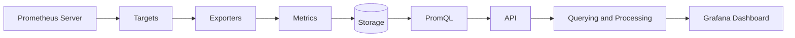

#### <strong>Grafana</strong>

Grafana is an open source platform for visualizing and analyzing data. It provides an intuitive user interface that allows users to collect, store and monitor data from various sources in real time. Grafana supports various data sources such as Graphite, InfluxDB, Prometheus, Elasticsearch, MySQL, PostgreSQL and many others.

Grafana allows users to create custom dashboards to display data in a visually appealing way. Dashboards can include a variety of data visualizations, including graphs, tables, heat maps, maps and more. Grafana also offers an extensive library of plug-ins and templates that users can use to customize and enhance their dashboards.

Grafana is especially useful for system administrators, DevOps engineers, and data analysts who need to collect and monitor data from multiple sources.

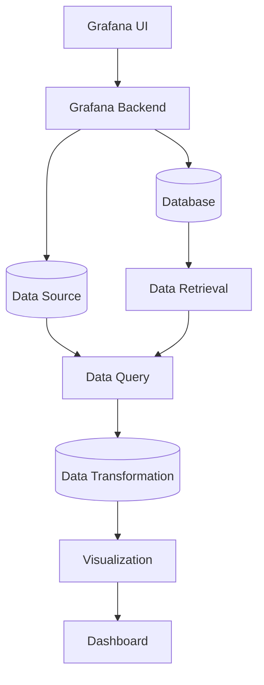

#### <strong>SonarQube</strong>

SonarQube is an open source static code analysis platform that enables developers to improve the quality of their code. The platform offers a variety of features, including analyzing code quality, detecting security vulnerabilities, measuring code coverage through testing, evaluating code architecture, and monitoring code development against common development standards.

With SonarQube, developers can quickly and easily get feedback on their code to identify and fix issues before they become serious problems. The platform supports multiple programming languages, including Java, C#, C/C++, Python, JavaScript and TypeScript. In addition, SonarQube offers integration with a wide range of development tools and environments, including IntelliJ IDEA, Eclipse, Visual Studio, Jenkins, GitLab and GitHub.

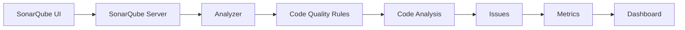

#### <strong>Sentry</strong>

Sentry ist ein Tool zur Überwachung und Fehlerbehebung von Anwendungen und Websites. Es hilft Entwicklern dabei, Probleme in Echtzeit zu erkennen und zu beheben, indem es Fehlermeldungen, Absturzberichte und Leistungsprobleme erfasst und analysiert.

Sentry kann in fast jeder Umgebung eingesetzt werden, einschließlich Webanwendungen, mobilen Apps und Desktopanwendungen. Es kann auch in verschiedenen Programmiersprachen wie Python, JavaScript, Ruby, Java und anderen verwendet werden.

Sentry bietet eine breite Palette von Funktionen, einschließlich der Möglichkeit, Fehlermeldungen nach Projekt, Version, Datei und Benutzer zu filtern, sowie die Möglichkeit, Probleme zu priorisieren und Benachrichtigungen an das Entwicklungsteam zu senden, wenn ein neues Problem auftritt. Es unterstützt auch die Integration mit anderen Tools wie Slack, JIRA und GitHub, um den Workflow zu verbessern.

Insgesamt ist Sentry ein leistungsfähiges Werkzeug für Entwickler, das dazu beiträgt, die Qualität und Zuverlässigkeit von Anwendungen und Websites zu verbessern, indem es ihnen ermöglicht, Probleme schnell zu erkennen und zu beheben.

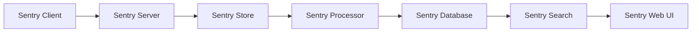

### <strong>Testing</strong>

Why do you create tests for software?

People create tests for software for a variety of reasons, but essentially they are used to ensure that the software works properly and meets requirements.

Some of the most important reasons why one creates tests for software are:

1. Quality assurance: tests help ensure that the software is bug-free and provides the expected functionality.

2. Risk mitigation: testing helps minimize the risk of malfunctions or errors that could have a negative impact on users.

3. Time and cost savings: testing can identify and fix bugs early, which can reduce errors and associated costs.

4. onfidence in the software: testing can increase user confidence in the software by ensuring that it is reliable and secure.

5. Regulatory compliance: In some industries, testing is required to ensure that the software meets certain standards and regulations.

Overall, testing helps to ensure the quality and reliability of the software and ensures that it meets user requirements.

In oure case we use a selenium test in kombination with Jest.

[](https://www.selenium.dev/)

[](https://jestjs.io/)

Selenium is an open source web browser automation framework. It allows developers to write and run automated tests for web applications to ensure that they work properly. Selenium supports a variety of programming languages, including Java, Python and JavaScript.

Jest, on the other hand, is an open-source JavaScript testing framework designed specifically to work with React. It is known for its simplicity and rich features that make it easy to create tests. Jest also supports snapshots, which allow developers to write visual tests for their React components.

When it comes to React, Selenium is typically used to run end-to-end tests, where a web application is loaded in a web browser and then automatically run through to ensure all features work as expected. Jest, on the other hand, is typically used for unit testing, where small units of source code are tested to ensure they work as expected. However, Jest can also be used for integration tests that connect different parts of the web application.

Overall, Selenium and Jest complement each other well to provide complete testing coverage for React applications. Developers can use Selenium to run end-to-end tests and ensure that their application works properly, while Jest can be used to run unit tests and ensure that every part of the source code works properly.

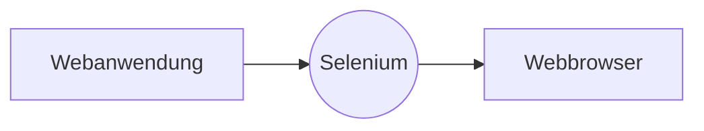

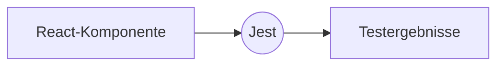

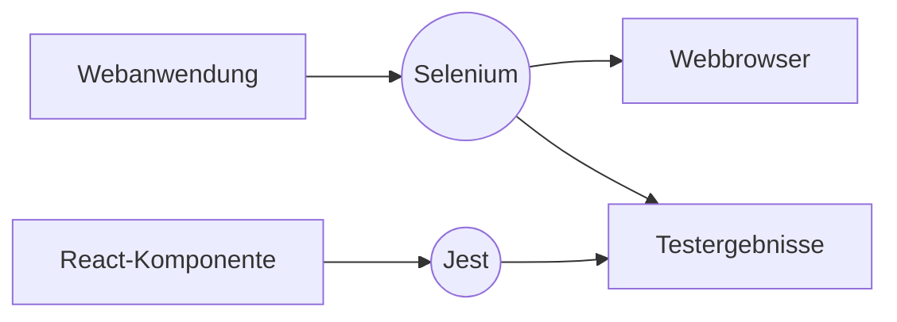

- [x] Login-System
  - [x] Sign UP
    - [x] Custom
      - [x] With Out error
      - [x] With error
    - [x] With Keycloak
  - [x] Login
    - [x] With OTP
    - [x] Without OTP
    - [x] With Keycloak
- [x] Edit Profil
  - [x] Change Status
  - [x] About
  - [x] Phone
  - [x] Website
  - [x] Street Name
  - [x] Street Number
  - [x] City
  - [x] Country
  - [x] State
  - [x] Zip
- [ ] Messanges
  - [x] Create new Direkt Message
  - [x] Send
  - [x] recived
  - [ ] Show Old
- [ ] Call
  - [ ] Join a Call
  - [ ] Mute
  - [ ] Hidden Video
  - [ ] Screen Share
  - [ ] Messanges
    - [ ] Send
    - [ ] Recived

### <strong>Patches</strong>

- [ ] UI/UX
  - [ ] Loading Screen
- [ ] Video
  - [ ] Cleaner remove from duplicates
  - [ ] efficiency
- [x] Add features to the input field
  - [x] Features
    - [x] Markdown
    - [x] Mermaid
  - [x] Make Features Visible in messanges
- [ ] Drag and Drop
- Inbtegration with the [Calnedar App](https://github.com/noahzmr/react-calendar)

## <strong>Architecture</strong>

### <strong>SQL</strong>


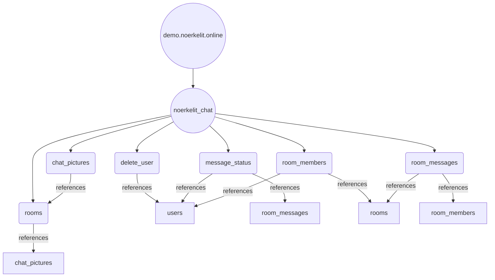

### <strong>Network</strong>


## Setup

For the app to communicate with Keycloak without problems, a valid SSL certifkat is required the url must also match the certificate, otherwise you get a "Name Mismatch Error".

You can just pullen the Docker image, or just copy the project and use the `docker-compose`. Whether you want to set it up with Docker or local you need to set the following values:

- [ ] HTTPS
  - [ ] `cert.cer` file (in the backend and the ui folder)
  - [ ] `key.key` file (in the backend and the ui folder)
- [ ] Create a `.env` file
- [ ] Sentry DSN in the React app in the `ui/src/config.json` and the `.env` file
- [ ] Setup Keycloak in the `ui/src/config.json`

The `.env` file must contain the following items:

```env
# MariaDB informations
DB_HOST=<DB Host IP or DNS>
DB_PORT=<DB Port>
DB_USER=<DB User>
DB_PASSWORD=<DB Passwort>
DB_DATABASE_CHAT=noerkelit_chat
# Minio
MINIO_ROOT_USER=<Minio User>
MINIO_ROOT_PASSWORD=<Minio Password>
    # Client
MINIO_CLIENT_ENDPOINT=<Minio IP or DNS>
MINIO_CLIENT_USESSL=<USe SSL?>
MINIO_CLIENT_ACCESSKEY=<Minio Acceskey>
MINIO_CLIENT_SECRETKEY=<Minio Secret>
# Email Settings
MAIL_HOST=<Mail Smtp Server>
MAIL_PORT=<Mail Port>
MAIL_USER=<Mail User>
MAIL_NAME=<Show name>
MAIL_PASSWORD=<Email Password>

SENTRY_DSN=<Sentry DSN>
```

The `config.json` file must contain the following items:

```json
{
  "SENTRY_DSN": "",
  "KC_URL": "",
  "KC_REALM": "",
  "KC_CLIENT": "",
  "JEST_CHAT_ID": "",
  "JEST_GITHUB_USER": "",
  "JEST_GITHUB_PASSWORD": "",
  "JEST_OUTLOOK_USER": "",
  "JEST_OUTLOOK_PASSWORD": ""
}
```

## Contact

<div style='display: flex; flex-direction: row; justify-content: space-around; width: 200px;'>

[](https://www.xing.com/profile/NoahDanyael_Zeumer/)

[](https://www.linkedin.com/in/noah-zeumer-34b5081a5/?originalSubdomain=de)

[](mailto:noah@noerkelit.online)

<a href='https://taag.co/GxxtAjXSpr1679622602xuDhbkVpDX' target="_blank"></a>

</div>

## Hosted

<div style='display: flex; flex-direction: row; justify-content: space-around;'>

<a href='https://medocino.net/' target="_blank"></a>

<a href='https://medocino.net/' style="width: 200px;" target="_blank"></a>

</div>

medocino Hamburg GmbH is an experienced system house and IT service provider specializing in the development and support of IT infrastructures. With a team of dedicated IT experts, we offer comprehensive services and customized solutions for well-known corporations, medium-sized companies and start-ups.

Our customers appreciate our expertise, experience and passion for IT. We see IT as a solid craft and offer individual solutions tailored to the specific requirements of each company. In doing so, we rely on reliable technologies, innovative approaches and proven methods.

As the medocino group, we offer holistic support and stand by our customers as a reliable partner. Our team consists of highly qualified employees who are not only technically skilled but also highly customer-oriented.

However, we are not only active as a service provider, but also as a training company for prospective IT specialists in system integration. I speak from experience, as I am currently doing an apprenticeship at medocino and am part of the team. With us, you have the opportunity to complete an apprenticeship in the IT field and also become part of our team. I can say from my own experience that we attach great importance to a sound education and offer you the chance to gain practical experience and to develop professionally.

Our goal is to optimize our customers' IT infrastructure, improve processes and create real added value. We offer comprehensive services in the areas of storage technology, infrastructure automation, high availability solutions and data center services.

Rely on medocino Group to help you overcome your IT challenges and successfully move your business forward. Contact us today to learn how we can help you.

Below, I present a graphical overview of the wide range of services offered by medocino Hamburg GmbH.

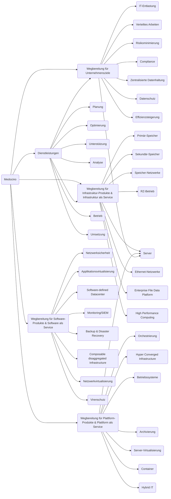

I am incredibly grateful to have the opportunity to complete my training at Medocino. Here, I not only get the chance to familiarize myself with the classic tasks of system integration, but also to gain insights into the exciting areas of software development and IT security.

What makes working here particularly rewarding is the variety of services that are available to me. For example, I can access tools such as Sentry, GitLab and SonarQube to optimize my work and develop high-quality solutions. These resources allow me to develop my skills and continuously improve in my area of expertise.

I am excited to see what exciting projects and challenges are still waiting for me and look forward to being part of the Medocino team.

## Support

If you want to support my work, you are welcome to buy me a cup of coffee. Just visit my [](https://www.buymeacoffee.com/noahdnylzmr)
and enter an amount of your choice. I am grateful for any support.
Thank you in advance!

## Demo

Hello,

I would like to inform you that there is a free demo version of my GitHub repository that you can access. This demo version gives you the opportunity to try and test the system before you decide to use the full version.

Please note that when registering for the demo version, we recommend that you do not use passwords that are used in other services, if you register with an Identify provider we will never see the password. If you register without an Identify Provider, the password will be hashed and salted, so we will not be able to read it in plain text.
But why use strong passwords and always use different ones?
It is important to use strong passwords and make them unique for each service or account to protect your security and privacy. A strong password should consist of a combination of letters, numbers and special characters and be at least 8-12 characters long.

Using the same password for different accounts can create a security risk. If an attacker gains access to one password, they can use it to access all accounts that use the same password. This means that an attacker can access and potentially misuse your sensitive information, such as bank accounts, emails or social media profiles.

Using unique passwords for each account significantly reduces the risk of such a takeover. If a password for one account is compromised, the other accounts will still have another strong password that is not compromised.

So it is very important to use strong passwords and make them unique for each service or account to protect your security and privacy.

We are not responsible for any activities that take place on the demo version. Data will be deleted periodically to ensure that your privacy and security remain protected.

Thank you for your interest in my repository. I hope you will use the demo version and gain valuable insights.

## License

This project is licensed under the [BSD 2-Clause License](https://github.com/noahzmr/react-chat/blob/main/LICENSE.md). Please note the terms and conditions of this license.
